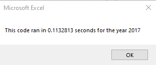

# Stock-Analysis Project

## Overview of Project
Given a data set with a wide variety of different stocks and prices it was my job to create a user friendly VBA application that Steve could use to help him understand trends in the market. In addition, I looked to output answers as efficiently and swift as possible by refactoring code. With this challenge, I had to enable macros through Excel to access the power of VBA. With this program, I looped over stock data from 2017 or 2018 to determine the magnitude at which different types of stocks were being traded, the rate of return for the various stocks, and refactored code to make it run as fast as possible. 

## Results
By using tickers to determine the type of stock that was being displayed I came to several conclusions based on the data given to me. One is that in general, the stock categories from 2017 tended to have a successful return (11/12 major stocks types yielded a positive return on the investment for the year of 2017). However, in the year 2018, only two of the twelve stock types had a positive return. From this, we can conclude that people probably made money off their stock in 2017, while in 2018 there was a much higher chance for their stock to have gone down in value.

## Run Time and Results
Using the refactored code, I was able to make the exectuion time decrease. To decrease the run time, I found several factors that helped cut the processing time down. Small things like accessing worksheets before the loop ran so that they were not reopened at the beginning of each pass, and cutting down on unneccessary intermediate steps to make the code less choppy helped to decrease my run time.

### Refactored Code for 2017 Data
In 2017, eleven of the tweleve major stock types were positive for the year. Based on this data, there is a strong chance that if someone held stock during the 2017 year, they likely made money. My run time for the program execution on my computer was XXXX seconds. The findings of my refactored code for 2017 and runtime for my 2017 code is displayed below.

### Refactored Code for 2018 Data
In 2018, only 2 of the tweleve major stock types were positive on the year. In regard to this dataset, if someone held stock during the 2018 year they are likely to have lost money. My run time for the program execution on my computer was XXXX seconds. The findings of my refactoed code for 2018 and the runtime
for my 2018 code is shown below.

## Summary
Refactoring code is an extremely important process with an end goal of making code run as fast and efficiently as possible. In general, it is a great technique when used correctly. However, one must be careful in how they refactor a dataset.

### 1) What are the advtanges or disadvantages of refactoring code?
One huge upside to refactoring code is making the run time faster.This can be very important especially when working with extremely large datasets. In this case, we did not have an exceptional amount of code, but if we were working with millions of data points, making sure the program ran as fast as possible would be extremely important. The downsides of refactoring are very few, but one of the biggest worries is changing the data and losing interpretability.

### 2) How do these pros and cons apply to refactoring the original VBA script?
The refactored code was much more efficient in my case. When I first wrote code in my module, I was still trying to figure out the best way to display my findings. Upon my second pass through my workflow, I realized I had lots of unnecessary code which increased my run time. For me, there was no downside to attempted to refactor. My code ran smoother and was easier to read.
